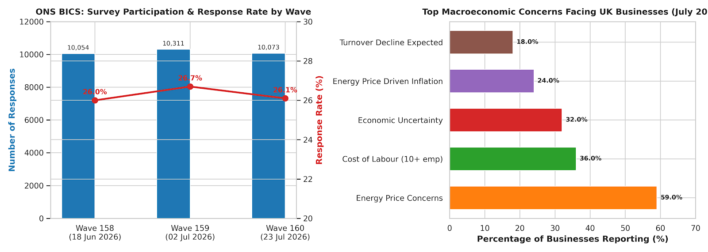

# ONS BICS: UK Business Sentiment & Analytics Engineering Pipeline

## Why I Built This
Most data projects rely on synthetic sample datasets like *Superstore* or *Titanic*. I built this end-to-end pipeline using real, raw survey waves from the **Office for National Statistics (ONS) Business Insights and Conditions Survey (BICS)** to track actual commercial pressures facing UK businesses (inflation, turnover expectations, and labor cost constraints).

---

## Visualizing UK Macro Insights


---

##  Key Business Findings (July 2026 Data)
* **Enterprise vs. SME Disparity:** While overall businesses rank **Economic Uncertainty (32%)** as their top turnover threat, larger firms (10+ employees) are overwhelmingly constrained by **Cost of Labour (36%)**.
* **Energy Inflation Risk:** **59%** of UK businesses report concern over energy prices, with **24%** actively planning price increases to offset energy overheads.
* **Survey Participation Health:** Response volumes peaked at **26.7%** in Wave 159 before normalizing to **26.1%** in Wave 160.

---

##  Data Architecture & dbt Modeling
This repository transforms raw ONS survey metrics into clean analytical data models using **dbt (data build tool)**:

```text
raw_ons (PostgreSQL) 
   └── staging/ 
       ├── stg_ons_survey_waves.sql
       └── stg_ons_business_insights.sql
   └── marts/
       ├── dim_survey_waves.sql (Window functions, LAG participation tracking)
       └── fct_business_insights.sql (DENSE_RANK challenge severity)
